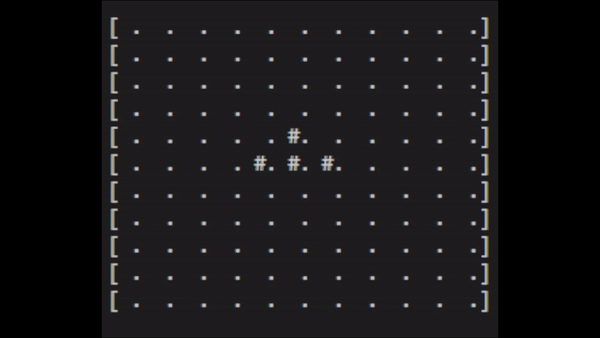

# py-game-of-life
Simple (console-animated) Game of Life implementation in Python.

Usage:

    def draw_glider(on_grid):
        on_grid[3, 1] = 1
        on_grid[3, 2] = 1
        on_grid[3, 3] = 1
        on_grid[2, 3] = 1
        on_grid[1, 2] = 1
    
    size= 11
    n_gen = 50
    grid = np.zeros(shape=(size,size))

    draw_glider(grid)

    gol = GameOfLife(grid, n_gen)
    steps = gol.generate_steps()

generate_steps() returns a list of animation steps to be used to compose an animated gif or with urwid:

